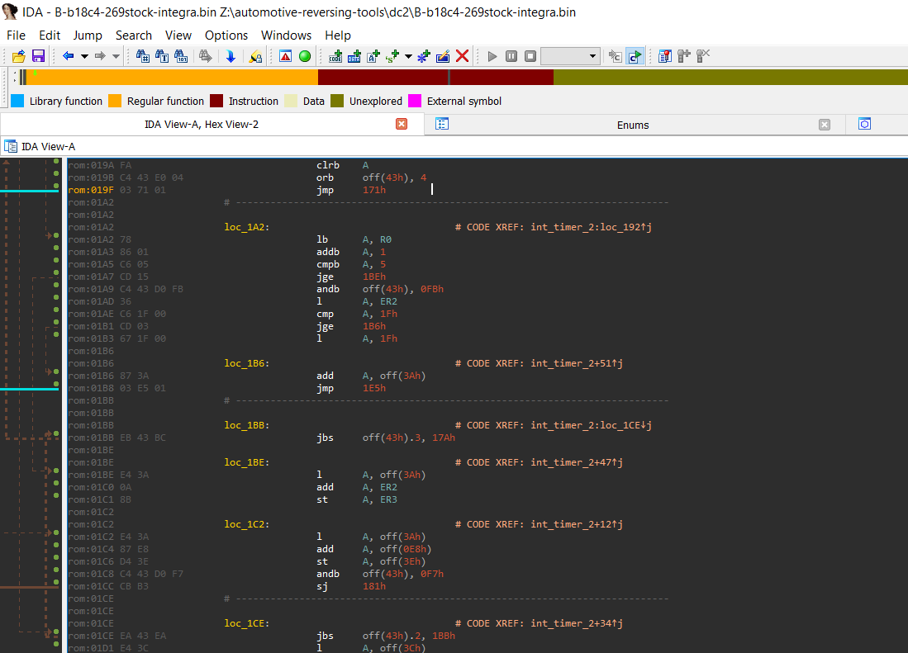

IDA Python OKI 66207 Loader and Processor
=========================================

Work in progress for Honda ECUs.

STILL IN VERY EARLY STAGE. It's a hack, basically.

I used nios2.py and ht68fb560.py as basis for this project. It's my first time
creating a processor module so there might be obvious mistake that I didn't
see. Feel free to submit corrections. The target for this module is to be able
to reverse 90's/00's Honda ECUs, more specifically Integra Type R's. So most
testing will be done with such firmwares.

### Files

- `honda-ecu-obd1-loader.py` detects that a binary is a Honda ECU (should detect, at some point, when I know the header. Right now accepts anything)
   --> Should be added to the /loaders folder
- `oki-66207-processor.py` is the processor file
   --> (`oki66207.py` is a temporary split of the above file)
   --> Should be added to the /procs folder, with oki66207.py
- `./helpers/op_to_array.py asm662-66207.op.modified` to extract instructions from asm662 files

### What's left

See `TODO`

If you know how to handle special processor flags in IDA/idapython, I'm curious (https://reverseengineering.stackexchange.com/q/22423/11827)

### Misc
- Little endian architecture (https://mycomputerninja.com/~jon/www.pgmfi.org/twiki/bin/view/Library/LittleEndian.html)

### Links

- http://wuffs.org/blog/mouse-adventures-part-7
- https://github.com/markjandrews/idatraining/tree/master/exercises/exercise11_processor_module
